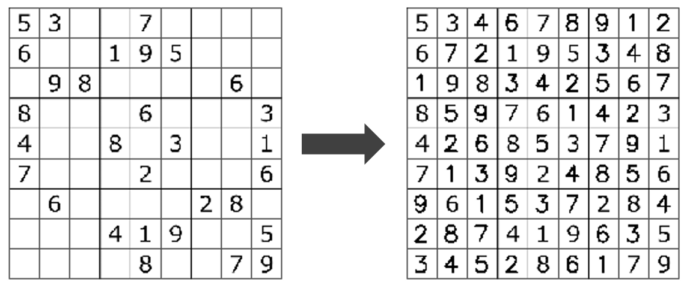

# Sudoku_Solver
 A program  to solve a Sudoku puzzle by filling the empty cells. Satisfying the rule "Each of the digit 1-9 must occur exactly once in each row".
 
 ## Requisite
 This program was written in Python 3.7.4 and includes various external libraries.
 1. OpenCV
 2. Numpy
 3. Matplotlib
 4. Tensorflow
 
 You can install these packages by following command.
 ```
$ pip install opencv-python
$ pip install numpy
$ pip install matplotlib
$ pip install tensorflow
```
### Approach
```
1.  Read sudoku image as an input.
2.  Resize and convert it to grayscale image.
3.  Apply thresholding and inverse all the bits so that the digits appears in white pixel.
4.  Find contours and select largest contour as sudoku grid.
5.  Detect the corners of the grid.
6.  Warp the image to get correct perspective.
7.  Split the image into 9x9 image grid.
8.  Crop each 9x9 image grid to remove other noise.
9.  Evaluate percentage of white pixels in each 9x9 image. If percentage of white pixel is less than certain threshold replace it with zero.
10. Pass these individual images through Convolution Neural Network to predict digits.
11. Arrage the predicted numbers in 9x9 grid.
12. Apply Backtracking to solve the sudoku.
13. Calculate centroid of each unsolved cell.
14. Display solved sudoku number on each centroid.
```
### Result

